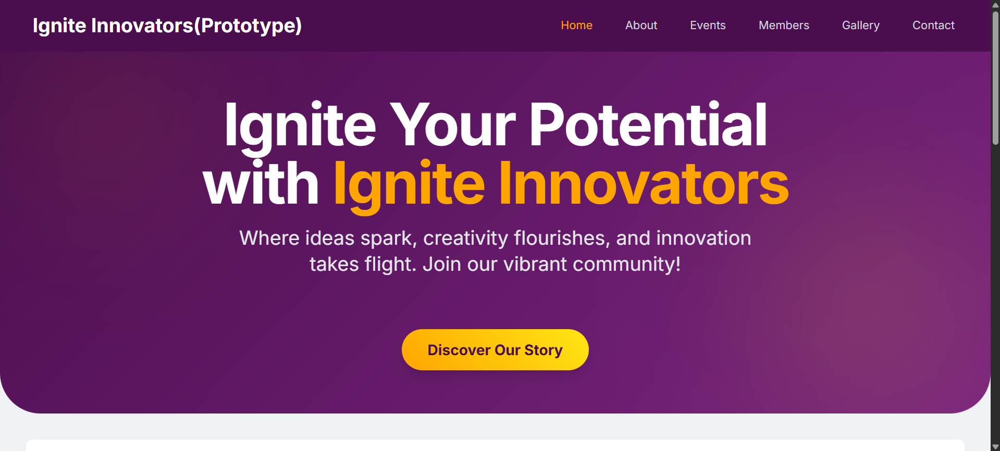
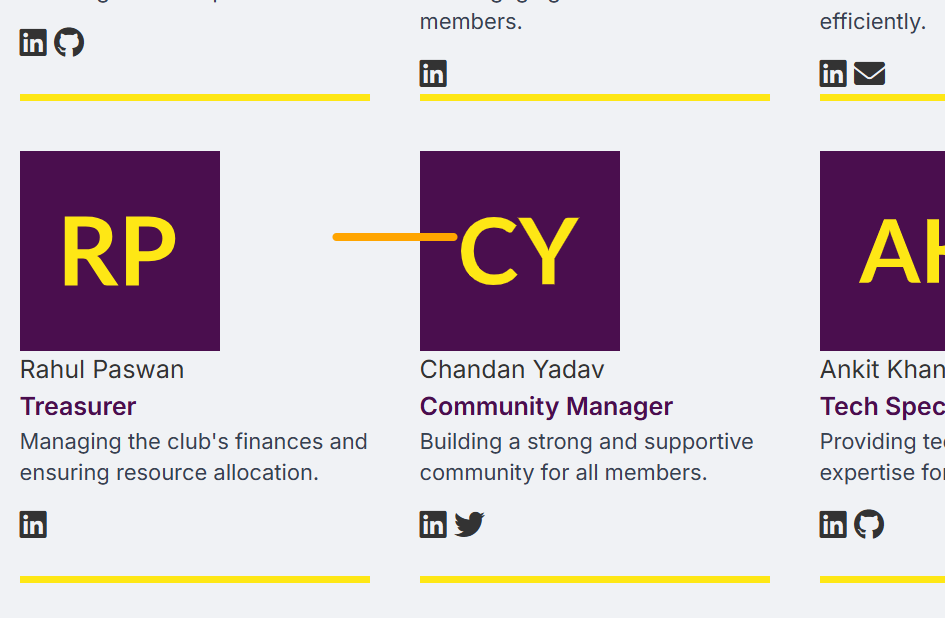
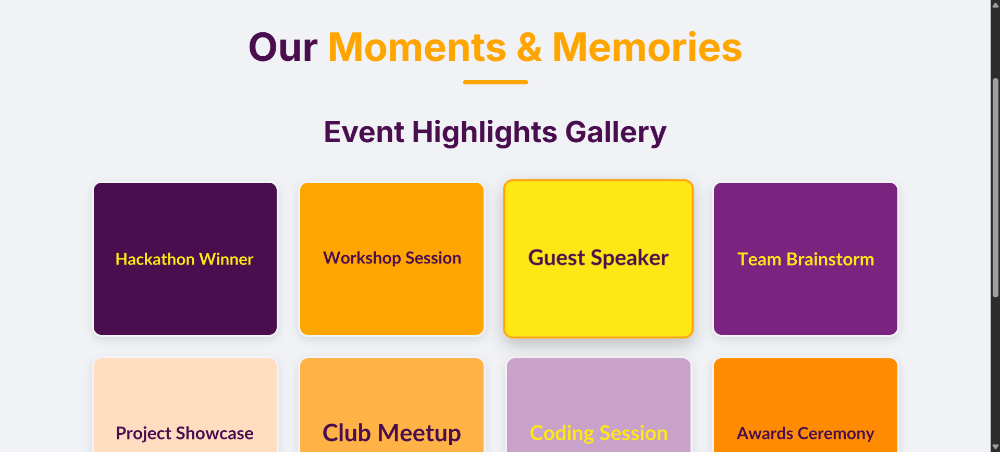

# 🎓 Ignite Innovators – College Club Website (Frontend)

A fully responsive and modern frontend website designed for the Ignite Innovators college club. Built using HTML, CSS, and vanilla JavaScript (no frameworks like React or backend systems).

---

## 📌 About the Project

This project represents the official website of a fictional or real college tech club named **Ignite Innovators**. The goal is to showcase the club’s mission, members, events, gallery, and contact details in an engaging way.

The site is built purely with HTML5 and CSS3, following modern design practices like responsiveness, hover animations, and visual aesthetics suitable for a student club.

---

## ✨ Features

- 🎯 **Landing Page** with Club Name and Navigation  
- 🧑‍🤝‍🧑 **About Section** – Club’s Mission and Vision  
- 🎉 **Events Page** – Details of Past & Upcoming Events  
- 📸 **Gallery** – Event highlights with modal image preview  
- 🙋 **Members Section** – Member profiles with social links  
- ✉️ **Contact Page** – Contact form styled but non-functional (frontend only)   
- 💻 **Fully Responsive** – Optimized for desktop, tablet, and mobile views 

---
# See it Live
- Live using github      https://anant8521.github.io/college-club/
- Live using vercel app https://college-club-one.vercel.app/

## 📷 Screenshots

### 🔹 Home Page


### 🔹 Members Page


### 🔹 Gallery Modal


---

## 🚀 How to Use / Clone This Repo

You can clone this repository to your local machine using either method:

### 🔹 GitHub CLI
```bash
git clone https://github.com/anant8521/college-club.git

